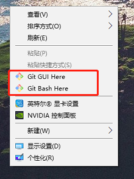

> 道阻且长，行则将至。埋头苦干，不鸣则已，一鸣惊人！加油，骚年！

# 1 前言
&emsp;&emsp;说实话，我刚开始也不知道git到底是什么，更不明白 git、GitLab、GitHub 之间到底有什么联系，又有什么不同，所以就感觉很恐惧，一点都不了解这是啥，我要怎么用？

&emsp;&emsp;git 官网：[git官网](https://git-scm.com/)

## 1.1 初探Git
&emsp;&emsp;然后工作这1年多，也全部使用的是 SVN，也没接触过 git，不过后来老大说后边我们部门也要转到 git，使用 git 来管理源码。然后要我们提前自学一下，然后给了个网站，是廖雪峰老师的网站教程，参考这个网站：[廖雪峰git教程](https://www.liaoxuefeng.com/wiki/896043488029600)。奈何当时看了网站的教程，没有记录电子笔记，现在想看看自己当时的笔记内容，突然发现找不到笔记本了:cry:，甚是遗憾。

&emsp;&emsp;简单回忆一下廖雪峰老师的教程
 - 权威，专业；当时我看到我们老大发的这个网站的时候，就感觉有一种似曾相识的感觉（我原来不是纯软件），然后总觉得在哪里听过这个老师的名字，可能这就是:cow:人吧！
 - 教程详细，内容通俗易懂；
 - 这份教程，给我的感觉就像一本书目录一样，哪里不会，直接翻到对应目录，进行点对点突破。
 - 最后总结，值得收藏翻阅！

## 1.2 Git再进宫:fist:
&emsp;&emsp;不过也刚好，促使我自己又重新学习，记录了一遍，然后自己自学过程中，参考的是黑马程序员的教程，参考这个网站：[Git零基础入门到实战详解](https://www.bilibili.com/video/BV1sJ411D7xN?p=1)。

&emsp;&emsp;也简单总结一下黑马程序员老师的这份教程
 - 很，特别，十分基础；老师简直就是0基础教学一样。（这也导致我前5节课，基本没记什么笔记:joy:）
 - 前边也说了，老师讲课的内容，十分基础，这也导致了老师的语速，特别慢！！！基本全程1.5倍速，遇到重点会暂停下来，进行实操。
 - 总得来说，还不错，起码有老师带着，系统的过了一遍，然后该倍速的倍速就好了。

# 2 git是什么？
&emsp;&emsp;根据 git 官网介绍如下：
> Git 是一个免费的、开源的分布式版本控制系统，可以快速高效地处理从小型到大型的项目。
Git 很容易学习，而且它的足迹很小，性能非常好。它超越了 Subversion、CVS、Perforce 和ClearCase 等 SCM 工具，具有廉价的本地分支、方便的暂存区域和多个工作流等特性。

&emsp;&emsp;简单的说，就是一个版本控制系统，类似常见到的版本修改说明表，不过这个可以借助于软件来帮助我们实现版本控制，很方便。

&emsp;&emsp;想要再具体的解释，可以参考廖雪峰老师的 git 简介，上边举的例子也很通俗易懂。传送门：[廖雪峰老师 - Git简介](https://www.liaoxuefeng.com/wiki/896043488029600/896067008724000)

# 3 git使用
&emsp;&emsp;直接去官网下载最新版本的 git ，安装过程呢，依我百度这么多经验来看，==一路 next 即可！==

&emsp;&emsp;安装完成后，鼠标右键应该会有这两个东东

